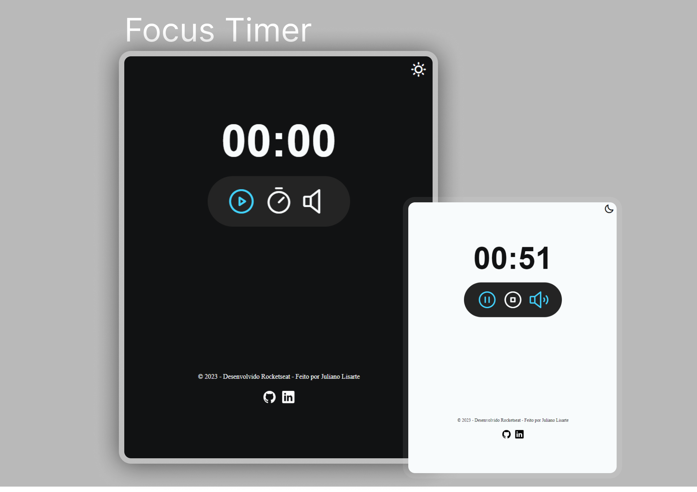

  

<h1 align="center">Focus Timer - Projeto do Explorer - Rocketseat</h1>

 

  
  <a href="https://jlisarte.github.io/projeto_focusTimer/" target="_blank">https://jlisarte.github.io/projeto_focusTimer/</a>

## 🚀 Tecnologias

Esse projeto foi desenvolvido com as seguintes tecnologias:

- HTML, CSS e JavaScript
- Git e Github
- Figma

## 💻 Projeto

Focus Timer  
O FocusTumer é um Timer desenvolvido em Javascript com possibilidade de alternar entre dark/light mode e música de fundo.
Projeto do Explorer - Rocketseat

---

Feito por Shadowkhan - Juliano Lisarte
